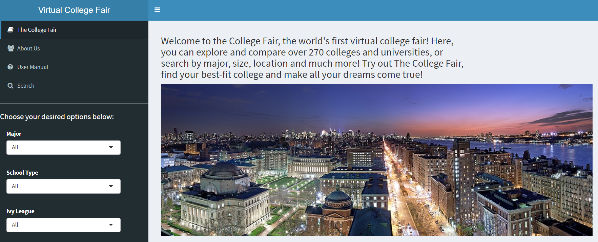
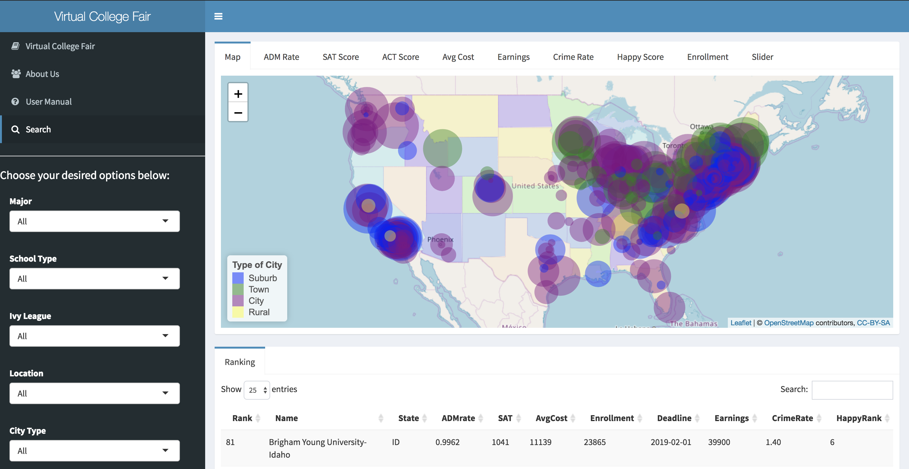
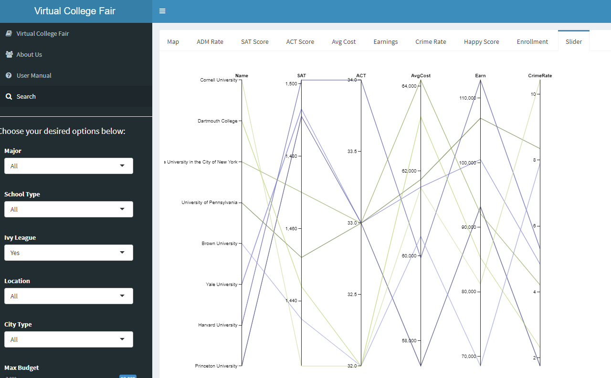

# Project [Shiny App Development Version 2.0] Virtual College Fair

### [Project Description](doc/project2_desc.md)
This is the instruction of this project. We conduct the project according to the guidelines from this file. 


## Project Title: Virtual College Fair
Term: Fall 2018
	+ Contact: Yin, Yiqiao eagle0504@gmail.com

### Shiny App Link: https://y-yin.shinyapps.io/Virtual__College__Fair/

+ **Background**: 

More and more international students are choosing to study in America today. It is reported that more than 1,200,000 international students study at around 4000 different U.S. colleges and universities. However, the college search process often creates huge challenge with all the information available everywhere in today's digital age. For many international students, it is hard to sieve through all the information overload, to collect various statistics, and to collate and compare them with ease. Exact details are hard to come by easily and there is often too much inertia to sieve through thousands and thousands of datasets. With around 50% of US highschools holding traditional college fairs, one can only imagine how rarely they occur internationally. In order to help students out with these issues, our team have developed an application called the College Fair. This applications aims to enable international and also native high school students to discover and compare schools in an more efficient manner. It provides users with a simplified platform to filter and rank universities based on their own preferences, and output an interactive map & various density plots that would allow them to view and compare selected statistics of the various universities.

In a nutshell, our overall philosophy behind the creation of this application is to provide an alternative, more lighthearted and personalized platform to simplify the college decision making process for college applicants, and make it easier to obtain information amongst the sea of madness. We believe our product can be of great value not only to individuals such as high school students (and their parents) but also institutions such as CommonApp or CollegeBoard.

+ **Project summary**: 

This project explores and visualizes 272 universities in America by using the data on ([College Scorecard Database](https://collegescorecard.ed.gov/data/documentation/)), ([2016 Forbes Ranking](data/ranking_forbes_2016.csv)), ([HappyScore Data](data/Happinessdata.csv)), ([Crime Data](data/CrimeData_final.csv)), ([Undergraduate Enrollment](/data/final5data_ACT%20Enrollment%20Crime%20Deadline_Oct5th.csv))，and ([College Application Deadline](/data/College%20Application%20Deadline_clean.csv)). We created a Shiny App to help users discover and compare universities. 



+ **Filter & Rank**: easily discover and compare the universities that meet user's requirements

Two filter parts. One part is the basic filter: the user can choose universities based on "Major", "Type of School", "SAT Score", "Ivy League Universities", "Location", and "Type of City". The other part is the advanced filter: they can give their weights to "Academic Performance", "Average Cost", "Earning & Jobs", "Social Security" and "Life Quality", based on how important they think these factors matter to them. 

Two ranking options. One option is based on the Forbes University Rankings. The other one is using the weights the user gave to calculate the rank of these universities - ultimately producing a personalized ranking. 

+ **Map & Plot**: visualization of relevant features of the universities 

Map: Every university that meet the user's requirments will show on the map. After clicking on the university, both the URL and Forbes rank of the school will be in view. The map also adds circular illustration of ranking according to Forbes Ranking System. The color of the circles indicate the City Type and the radius of the circles indicate the ranking of the college/university (the larger the circle the higher the ranking). 

Plots: There will be multiple interacitve density plots based on the filtered data. These will show Admission Rate, SAT Score, Average Cost, Earnings, Crime Rate, Happy Score, Happy Rank, and Enrollment of the selected (filtered) universities.



+ **Special Feature: Slider**: visualization from user input window of each parameter 

Slider: The slider filter uses the data set that is already filtered from the parameters on the selection inputs on the left hand side and then generates a slider interactive matplot of the selected schools with each designated user inputs. The slider filter interactive matplot has SAT, ACT, AvgCost, Earnings, and CrimeRate. From what is selected on the left hand side (for example, Ivy League), the output for "Slider" will give 8 Ivy League universities and then output the data for these candidates. User can also perform window selections, a range of data from each parameter according to user's own situation, and the left axis will output selected schools. 



+ **Contribution statement**: (Please also see [Contribution Statement](doc/contribution_statement.md)) 

All team members contributed equally in all stages of this project. All team members approve our work presented in this GitHub repository including this contributions statement. 

We also want to thank Professor Ying Liu and Professor Tian Zheng for hosting lectures of Advanced Data Science this semester. It is with transcending gratitude that we announce here what an inspiration both professors have been throughout our experience of building this shiny app. Their knowledge, understanding and genuine “care” for others is illuminated in everything they do! We, Group 8, are in forever debt for their teachings. Moreoever, we also want to thank TA, Chengliang Tang. There is not enough we can say about how much we thank heaven that he is our teaching assistance. His patience and understanding are unsurpassed. We are grateful for being his students.

+ **Reference**: 

This project is built upon Uni-Mate, a shiny app project from previous semester. We also add extra data from CollegeScoreCard website as additional information.

Uni-Mate Github: https://github.com/TZstatsADS/Spr2017-proj2-grp10
College Score Card: https://collegescorecard.ed.gov/data/


```
proj/
├── app/
├── lib/
├── data/
├── doc/
└── output/
```

Please see each subfolder for a README file.

